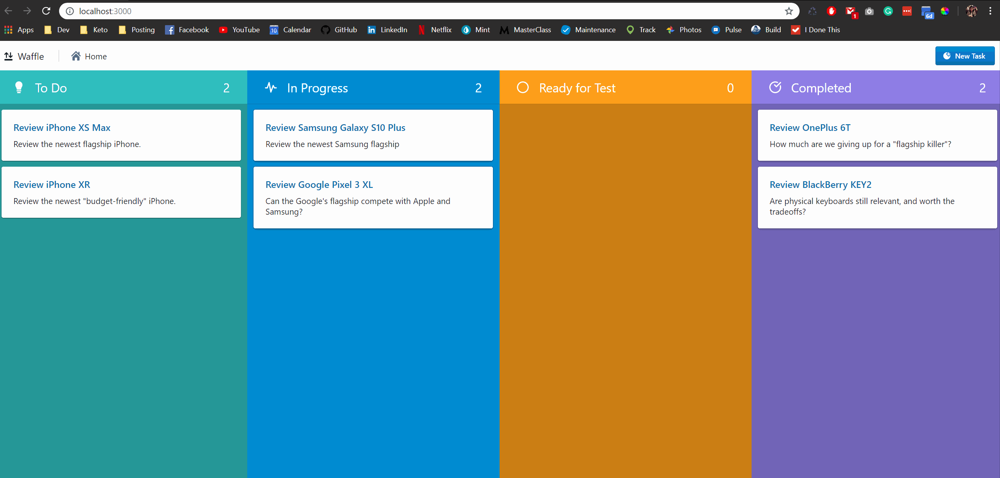
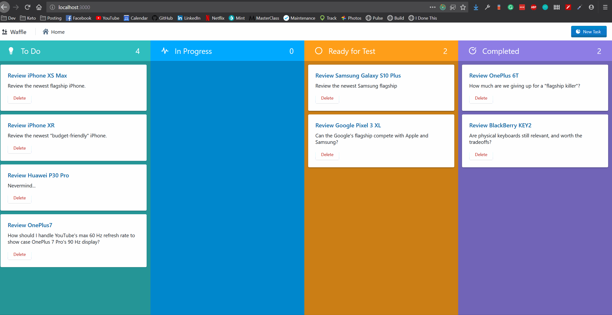
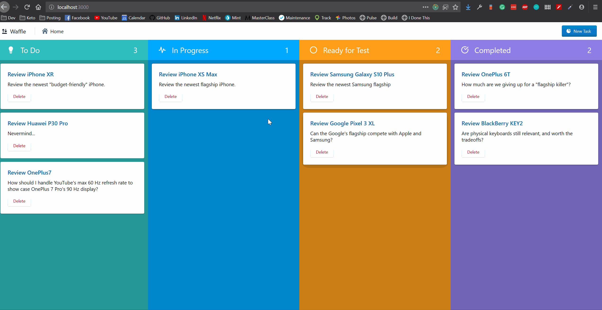
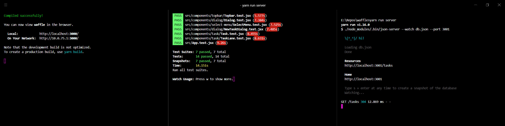

# Waffle

<!-- TOC -->

- [Features](#features)
  - [Add](#add)
  - [Delete](#delete)
  - [Move Task to Another Column](#move-task-to-another-column)
  - [Data Preservation](#data-preservation)
  - [Styling and Design](#styling-and-design)
- [Upcoming Functionalities](#upcoming-functionalities)
- [Tech](#tech)
- [Build & Test](#build--test)
  - [Prerequisite](#prerequisite)
  - [Build & Run](#build--run)
  - [Test](#test)
- [Naming](#naming)
- [License](#license)

<!-- /TOC -->

**Waffle** is a Kanban board web app, implemented as a client-side React-Redux application.

The application is still under active development; new functions are continually being built.

## Features

Besides the list below, the GitHub repo also contains lots of detailed information:

- You can look at [the closed pull requests](https://github.com/charliegdev/waffle/pulls?q=is%3Apr+is%3Aclosed) on details about how these functionalities are implemented, such as the [PR for SCSS import](https://github.com/charliegdev/waffle/pull/45) and its [closed issue](https://github.com/charliegdev/waffle/issues/38).
- Similarly, the GitHub [open issues](https://github.com/charliegdev/waffle/issues) contains the most up-to-date list of planned features and bug fixes.
- From a project management point of view, you can see how the pull requests and issues were managed inside the [GitHub Projects](https://github.com/charliegdev/waffle/projects) section; for example, the [Sprint 1](https://github.com/charliegdev/waffle/projects/1) board.
- _Optionally_, the [commits](https://github.com/charliegdev/waffle/commits/master) might tell some detailed information as well.
- Finally, you can visit the [Insight page](https://github.com/charliegdev/waffle/pulse) on the velocity of the development.

Below is a list of major implemented features.

### Add



### Delete



### Move Task to Another Column


### Data Preservation

Data is saved, so nothing is lost after refresh or server restart:



### Styling and Design

As an early prototype, I took [Meister Task](https://www.meistertask.com/) as my inspiration for my styles. In the future, when the product is more mature, there will likely be some changes in the art style.

## Upcoming Functionalities

Since the project is still at a very early stage, lots of functionalities are awaiting design and implementation. They are listed down below, with the highest priority item on the top:

1. Reordering tasks
1. Clicking on the task to open a modal dialog
1. User login/logout
1. Guest mode
1. Support for multiple projects
1. Email notification
1. A decoupling between projects and users, so:
   - A project can have multiple users
   - A user can own, view and subscribe to multiple projects

Besides new features, new tests should be written as well:

1. Redux unit tests
1. [Cypress integration tests](https://www.cypress.io/)

## Tech

This section is about the technology used to develop the application.

- [React](https://reactjs.org/) as the view library.
- [Redux](https://redux.js.org/) as the state container. Specifically, [Redux Ducks Pattern](https://github.com/erikras/ducks-modular-redux) is used, so the Redux codebase is organized to scale better for a large application.
- [Segment Evergreen](https://evergreen.segment.com/) & [Blueprint](https://blueprintjs.com/) as the React component libraries. All the components in Waffle are built based on Evergreen UI and Blueprint.
- [CSS Module](https://github.com/css-modules/css-modules) & [SCSS](https://sass-lang.com/) as the styling solution.
- [JSDoc and VS Code TypeScript service](https://www.typescriptlang.org/docs/handbook/type-checking-javascript-files.html) as an opt-in static type checker.
- [JSON Server](https://www.google.com/search?client=firefox-b-d&q=JSON+Server) as a temporary REST API server.
- Other libraries:
  - axios
  - React Router DOM
  - ESLint
  - Jest

I plan to use these technologies in future developments:

1. [Cypress](https://www.cypress.io/) in integration testing. At this point, the application is big enough to have meaningful automated integration test, so I think it's a great idea to start writing tests alongside development, instead of waiting for the application to get much larger and introduce regression bugs without knowing.
1. One of [Python Flask](http://flask.pocoo.org/) or [PHP Laravel](https://laravel.com/) as the server technology. Right now I'm using JSON Server which is fine for storing, modifying and retrieving tasks; however, to do anything substantial on the server side, I'll need a real server technology, and both Flask and Laravel are something I would like to try.

## Build & Test

If you would like to run this on your machine, follow these steps.

### Prerequisite

Make sure you already have those installed:

- [Node.js](https://nodejs.org/en/). `npm` comes automatically as part of Node.js; optionally, you can also install [Yarn](https://yarnpkg.com/en/) from Facebook.
- [Git](https://git-scm.com/)

### Build & Run

1. Clone the repo: `git clone git@github.com:charliegdev/waffle.git`
1. On the command line, navigate to the repo directory.
1. In the directory, run `yarn` or `npm i` to install all local dependencies.
1. Once all the dependencies are installed, run `yarn start` or `npm start` to start the Webpack server for the client.
1. In another terminal tab, navigate to the project root and run `yarn run server` or `npm run server` to start the JSON server.

### Test

To start the test, navigate to the project root and run

```bash
yarn test
```

or

```bash
npm test
```

We haven't setup Cypress tests yet, so the unit tests in Jest is all we have.

Here is a sample terminal output in [Hyper](https://hyper.is/):



## Naming

Its name happens to clash with another [now-closed Kanban board app](https://www.cypress.io/) with the same name. When I thought of the name _Waffle_, the application mentioned above was already closed, and I wasn't aware of its existence. I don't have a plan to monetize from this product; but if I do one day, I will probably give the application an external product name to avoid potential legal hassle.

## License

MIT license. Use it in whatever way you want; credit is appreciated.
