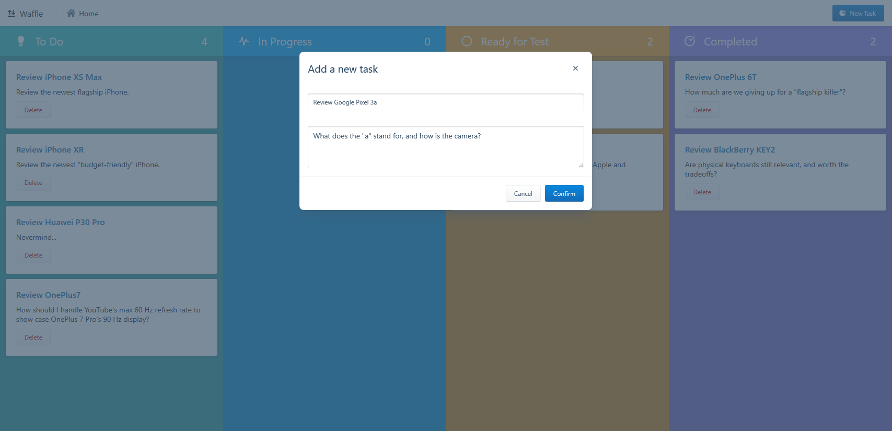

# Waffle

<!-- TOC -->

- [Functionalities](#functionalities)
  - [Add New Tasks](#add-new-tasks)
  - [Delete Task](#delete-task)

<!-- /TOC -->

Waffle is a Kanban board web app, implemented as a React-Redux application. Its name is partly inspired by another now-closed Kanban board app, Waffle:

[Farewell from Waffle](https://news.ycombinator.com/item?id=19400833)

The application is still under development.

## Functionalities

### Add New Tasks

### Delete Task
